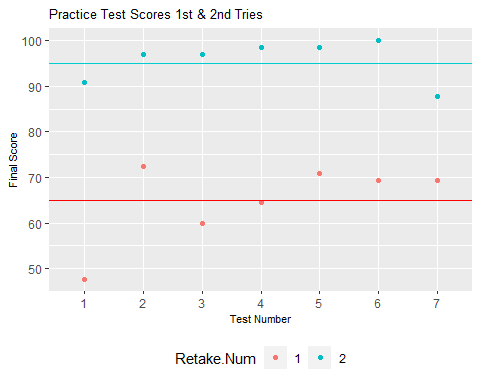

#### Background

I set a few challenging goals for myself this year. One of them is to
pass the AWS Data Analytics - Specialty certification.

Learning something new is as much daunting as it is exhilarating. It
requires discipline, commitment, and tenacity.

Rather than jumping straight to the exam preparation for the specialty
certification, I decided to first solidify my knowledge of the AWS Cloud
Infrastructure.

I had already achieved the Cloud Practitioner Certification sometime
last year, so I was already feeling good about my knowledge of the AWS
Cloud. However, I came to a realization that this knowledge was not to
my satisfaction when I took a Solutions Architect Associate mock exam
and didn’t perform well. I was reminded that it is one thing to know the
components of the infrastructure and their functions, but it is a whole
other thing to know how to architect these components in an
operationally excellent manner.

I decided that I must have the SAA certification before attempting the
DA specialty certification.

#### Learning Journey

Ryan Kroonenburg from acloudguru was my instructor. His course is really
a must take for all looking to gain practical knowledge of AWS. He
covers the theory of each and every component of the infrastructure,
complements it with lab practice and provides exam tips related to the
said component.

After completing the SAA course on acloudguru, I went back to Youtube to
listen to Andrew Brown, who himself has a great free SAA course. I only
did this because I really like his energy and his CCP course had
previously helped me achieve a near perfect score when I took the
certification exam. I let his video play in the background, which helped
me with retention.

Then I proceeded with my individual practice. I spent quite a bit of
time (and some money) in the AWS Console, practicing everything I had
learned, particularly, really nailing the design of VPCs and
multi-tiered architectures.

#### Exam Practice

For exam practice, there is no other place to go except Whizlabs. Their
SAA package contains 7 full fledged Practice Tests that mirror the
actual exam. In addition to these practice exams, the package contains
additional quizzes for different topics, i.e. quizzes on S3, EC2, IAM,
Lambda, etc. In total, there are 760 questions to really practice for
the exam. My objective was to take each of the 7 practice tests at least
twice before I schedule my certification exam. Although each test has a
2h20 minutes time limit, I attempted to finish them in 90 minutes for
the first take and in 45 minutes for the retake just to add more
pressure on myself that is usually non-existent in a practice
environment. The process is that I would take the practice test, (most
likely fail it), revise my test report, and retake the test a day or two
days later, then move onto the next practice test. The great feature on
Whizlabs that I recommend is the labs that they have under many of the
questions. When reviewing the test report, if there are labs associated
to a given question, a link will be provided and one can complete the
lab to gain even more practical experience on that topic in question. I
highly recommend these labs.

To visualize my areas of weakness, I aggregated my practice test scores,
for the first take and retake, grouped in all the main domains of the
AWS Cloud Infrastructure: Design High Performing Architectures, Design
Resilient Architectures, Design Cost-optimized Architectures, and Design
Secure Applications and Architectures. This is a dataful story after
all.

Data Preview:

<table class=" lightable-classic-2 table" style="font-family: Arial; width: auto !important; margin-left: auto; margin-right: auto; margin-left: auto; margin-right: auto;">

<thead>

<tr>

<th style="text-align:left;">

Domain

</th>

<th style="text-align:right;">

Number.of.Questions

</th>

<th style="text-align:right;">

Correct

</th>

<th style="text-align:right;">

Percent

</th>

<th style="text-align:right;">

Test.Num

</th>

<th style="text-align:right;">

Retake.Num

</th>

</tr>

</thead>

<tbody>

<tr>

<td style="text-align:left;">

Design High Performing Architectures

</td>

<td style="text-align:right;">

31

</td>

<td style="text-align:right;">

13

</td>

<td style="text-align:right;">

43.3

</td>

<td style="text-align:right;">

1

</td>

<td style="text-align:right;">

1

</td>

</tr>

<tr>

<td style="text-align:left;">

Design Resilient Architectures

</td>

<td style="text-align:right;">

20

</td>

<td style="text-align:right;">

12

</td>

<td style="text-align:right;">

60.0

</td>

<td style="text-align:right;">

1

</td>

<td style="text-align:right;">

1

</td>

</tr>

<tr>

<td style="text-align:left;">

Design Cost-optimized Architectures

</td>

<td style="text-align:right;">

5

</td>

<td style="text-align:right;">

1

</td>

<td style="text-align:right;">

20.0

</td>

<td style="text-align:right;">

1

</td>

<td style="text-align:right;">

1

</td>

</tr>

<tr>

<td style="text-align:left;">

Design Secure Applications and Architectures

</td>

<td style="text-align:right;">

9

</td>

<td style="text-align:right;">

5

</td>

<td style="text-align:right;">

55.6

</td>

<td style="text-align:right;">

1

</td>

<td style="text-align:right;">

1

</td>

</tr>

<tr>

<td style="text-align:left;">

Design High Performing Architectures

</td>

<td style="text-align:right;">

31

</td>

<td style="text-align:right;">

30

</td>

<td style="text-align:right;">

96.4

</td>

<td style="text-align:right;">

1

</td>

<td style="text-align:right;">

2

</td>

</tr>

<tr>

<td style="text-align:left;">

Design Resilient Architectures

</td>

<td style="text-align:right;">

20

</td>

<td style="text-align:right;">

19

</td>

<td style="text-align:right;">

95.2

</td>

<td style="text-align:right;">

1

</td>

<td style="text-align:right;">

2

</td>

</tr>

</tbody>

</table>

I must admit that the practice tests made me really humble. From the
graph below, the average score across all 7 test for the first try is
65, which is effectively a fail (70% is required to pass). I took the
second try after a careful review of all answers and I still didn’t
manage to get the maximum score. I must however admit that time
constraints that I put on myself played a role in the poor performance.

My performance was balanced across all domains of the AWS Cloud
Infrastructure. No area stood out as significantly different from the
rest.

#### Exam day

I went into the exam, well prepared and very confident. I took my time
and read all questions carefully. I gained even more confidence as the
exam progressed because all the questions looked very familiar. It was
still a great relief and deep satisfaction when I saw that **PASS** at
the end of 140 minutes.

#### Next steps

Now I feel ready to take on the Data Analytics Specialty Certification.
If you have any good resources beyond AWS Documentation that might help
accelerate my learning, please kindly share them with me. I hope to
write a follow up post by the end of the year, reporting on the
successful completion of this goal.

### NEVER. STOP. LEARNING.
